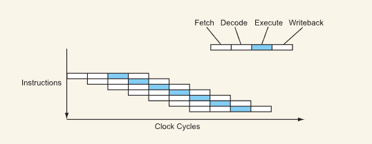

这是阅读[现代体系结构入门](https://www.lighterra.com/papers/modernmicroprocessors/)后所作的笔记。

### 流水线

一般来说，CPU中指令的执行包括4个阶段（取指，解码，执行，写回）。这样来说，CPU的CPI就是4，因为一条指令需要4个cycles才能完成工作。
下图展示的就是一个没有pipeline的CPU的指令工作图。

再下图展示的是有Pipeline的CPU，理想状态下CPI可以达到1。A指令在解码的同时B指令在执行，这样一个Circle可以同时有4条指令处于不同的流水线阶段。

#### 捷径（Bypass）

我们可以看到指令的最后一个阶段是Writeback，一般是写回到内存（缓存）或者寄存器中，但如果下一条指令的执行正好需要上一条指令的结果，可以直接将这个通过**bypass**直接传给下一条指令。具体如下图所示：

#### 多逻辑处理

执行阶段可以处理多种不同操作，因为CPU有多个不同的逻辑处理单元。如下图所示：

注意，这里说的不是并行处理不同操作，那是后文中要讲的超标量技术。

### 超流水线

现代CPU有着比上文介绍的4条流水线更深的流水线，即将基本的流水线再进行细分。比如Pentinum 4E Prescott就有着31条流水线。这样CPI还是1，但是CPU的频率可以变得更高。下图是超流水线的示意图：

#### 缺陷

超流水线的缺陷主要有2条：

1. 流水线变深会导致延迟增加一条指令实际完成所需要的Cycle数。不过这点需要两面地去看，因为CPU的频率也增加了，执行一个Cycle的时间变短了；
2. 一旦预测分支失败，由于流水线很深，需要重置的指令数变多。以上面所述的Pentinum为例，虽然预测分支的正确率达到了95%，但由于过深的流水线，重置的代价过高，表现也就不太好。

### 超标量

由于CPU有多个不同的处理单元，包括整数，浮点数，跳转等等，所以我们可以在执行阶段并行处理不同的指令来加速CPU。这样CPU同时也需要具备同时取多条指令，解码多条指令的能力。不过取指和解码相对于执行阶段的设计都更为简单。下图展示了超标量执行流水线的阶段：

我们可以看到，不同指令的执行需要的流水是不同的，整数操作就比浮点数操作所需要的流水要少。所以我们无法界定一个CPU是多少流水的，整数是10，而浮点是15，包括bypass的存在，这种定义变得困难。
下图展示了具备的超标量现代CPU的流水线示意图：

如果代码的指令级并行做的足够好的话，一次可以有3条指令并行执行，CPI可以做到0.33。额，还是用IPC吧，3。

### VLIW（超长指令字）

实际上是将相互间没有依赖的指令封装到一条超长指令中。这样可以将指令并行交由编译器优化，在目前的AI特定领域处理器有使用，通用处理器这个方法基本失败（为了兼容性）。

### 指令依赖与延迟

当指令间使用的数据存在依赖关系时，这2条指令就不能并行处理。比如说下面的代码：

~~~C
a = b * c;
d = a + 1;
~~~

d的运算依赖于a，这2条运算就不能并行处理。
指令的延迟主要有以下几点：

1. 过深的流水线导致延迟增大；
2. 从编译器的角度，不同指令有不同的延迟。整数加法一般是1个Cycle，浮点数乘法是3-6个Cycles；
3. Cache和内存以及硬盘的Load Latency。

### 分支预测

请见分支预测一文。

### 指令调度 & 重名寄存器 & 乱序执行（OOO）

由于不同指令延迟的不同，导致CPU的流水线并没有被完全占满，导致了资源浪费。而指令重排可以优化这个问题。
指令重排必须要保证的程序的逻辑和源代码所表示的逻辑是一致的。乱序执行需要额外的逻辑组件来判断指令的执行是否符合原先的逻辑。这也直接导致的retired instruction这一概念的诞生。
由于指令重排，也必须引入重名寄存器这一特性。众所周知，X64也只有16个通用寄存器（大雾）。实际上通用寄存器有几百个（来自知乎，不一定准），比如叫rbx的寄存器可以有好几个，当一条整数乘法在执行时，另一个rbx可以执行被拿去执行整数加法这样，这就是重名寄存器。

#### OOO的小tips

1. 实际上是否使用OOO是厂商需要慎重考虑的，因为OOO并不好实现，Intel甚至同时走2种技术路线；
2. The dirty little secret of OOO is that we are often not very much OOO at all（大雾）

### 功耗墙与ILP限制

功耗墙略过，就是遇到瓶颈散热跟不上了。
ILP限制则是说代码往往没有很好地利用ILP的特性，优化不到位或者是就是用不了，导致往CPU里堆逻辑处理单元也不会有很高的提升，反而增加了CPU其他方面的负载。（本质是一种trade off）

### X86

众所周知X86是CISC架构，而RISC架构具有优越性，更易于实现流水线，指令也更为简单。而X86为了兼容性，不能改变原有的指令。Intel的想法就是把CISC转为一种RISC，一条X86的指令可以转为多个微操作（μops），1个微操作可以看成是一条RISC指令。大多数X86指令可以被分解1，2，3个微操作。
重名寄存器就解决了X86上只有8个逻辑寄存器的尴尬（太少了）。而对于已解码的指令，X86CPU会使用一个小buffer来存储。这个小buffer被称为L0 Cache，用来加速指令到μops的translate过程。

微操作带来了一些界定问题。比如说一个CPU，1个Circle可以执行4个串行微操作，或者8个非串行微操作，以及CPU解码的指令数最多是5个。那么我该如何用1个数字界定该CPU的性能呢？It's a question.

#### 软件在X86->μops

Intel甚至使用过软件方法将X86指令转换为微操作，类似与JVM。虽然性能较差，但是非常省电。哦，对了，这个软件把X86指令转换为VLIW形式。

### 多核与超线程

由于上述种种体系结构所述的限制以及功耗墙，单核CPU的性能极难提升。

人们发现，虽然让CPU支持超线程技术，例如PC寄存器，SP寄存器这些都需要double，但实际上整体的电路结构只多了10%。超线程技术可以更加有效地利用流水线（实际还是要看具体应用和具体实现）。
对于单线程的ILP支持的很好的程序，超线程可能会使性能下降。而对于一些并行性很好的程序，受限与内存带宽，超线程也不会带来很好的性能提升。（音频处理，图像处理这些）
对于一些受限于内存延迟的应用，比如数据库，3D渲染，SMT可以带来很大的性能提升。
所以说SMT的使用，是要**具体问题具体分析**，不过一般而言SMT还是要开启的，毕竟性能下降的情况比较少见。

最后，超线程并不好实现，早期Intel的超线程有BUG。并且，超线程不知可以扩展成双线程，单核可以扩展成4线程甚至更多。

#### 多核还是大核

又是一个System级别的问题。我们是要一个大核（支持更多的线程），还是更多的小核。大核在频率等方面不好做，但在ILP很好的代码上很快；小核则更好设计，设计更好做。
最后，或许答案是我全都要，比如12代Intel（大雾）。不过大核不算好的设计，主流已经将它抛弃了，因为把核做大的复杂度上升是平方级别的。

### SIMD

这是一种数据并行，即一条指令，多个运算。比如说有一个RGBW的像素值，正好占32bits，但中间需要4次加法运算。我们可以增加一点运算类型，使32位的寄存器支持这样的运算，这样对视频处理类应用加速很快。SIMD可以被扩展到64位，128位，256位甚至512位。

据说SIMD对数据库应用加速作用不大，但是有论文主题是SIMD加速数据库的。

还有，SIMD的挑战在于代码是顺序的，但SIMD是并行的，不好优化。

### 存储结构

对存储结构进行分级是计算机科学贯彻始终一大方法论。在上文中我们可以看到CPU甚至会使用L0Cache来做优化。

#### 为什么不增大L1Cache的大小

主要还是由于延迟导致的。据说Intel曾经将L1Cache增大了50%，但是延迟多了1个cycle。现代CPU的L1Cache命中率大概在90%，增大L1Cache会导致该指标提升。但是，总体测算下来，平均的访存延迟变大了。也就是说，L1Cache缓存的大小是一个需要着重考虑的点，需要考虑延迟，命中率等等因素。

但是，我们可以看到，Apple的新一代CPU的L1Cache有着惊人的192KB，是Intel的4倍。这是由两点导致的，第一是Apple的Page Size为16KB，是Intel的4倍，而缓存延迟可以被认为是寻址导致的，Apple和Intel寻址上代价一样，但Apple Page Size大，所以L1Cache也相应变大了。另外，M1 CPU的频率没有X86系列的高，对延迟的要求下降了。

#### 内存吞吐与延迟

主要难以优化的是内存的延迟。

以前的老CPU内存控制器在主板上，导致延迟更大，现代CPU基本都把内存控制器放在了CPU上。
